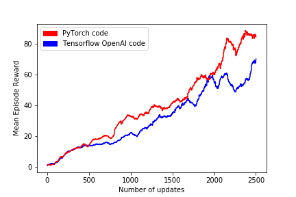

# PPO - PyTorch

## This implementation is inspired by:
1. OpenAI Tensorflow code: https://github.com/openai/baselines/tree/master/baselines/ppo2
2. https://github.com/ikostrikov/pytorch-a2c-ppo-acktr

To run training:

```bash
python trainer_plus.py
```


Comparison between OpenAI implementation and this implementation in Atari game `BreakOut`:





## Disclaimer
The Pytorch implementation is much cleaner and runs a bit faster in terms of wall-clock time, yet still achieve comparable performance in the `BreakOut` environment.
